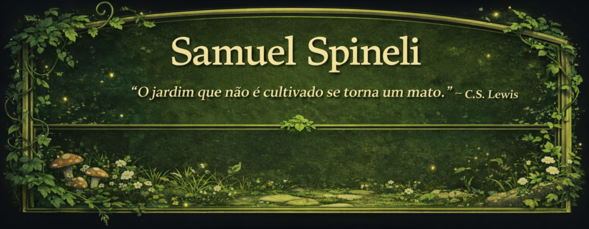

  <!-- BANNER -->
   <!--

  --><!-- BADGES DE TECNOLOGIAS (COLADAS HORIZONTALMENTE) --><!--
  --> <!--

  --><!-- GADGET 1: STATS CARD --><!--
  --><!--
  --><!-- GADGET 2: TOP LANGUAGES --><!--
  --> <!--

  --><!-- GADGET 3: WAKATIME (MOSTRA HORAS DE CÓDIGO - OPCIONAL) --><!--
  --> <!--

  --> <!--
  --> <!--
  --> <!--
  --> <!--

  --><!-- LINKS FINAIS --><!--
  -->

